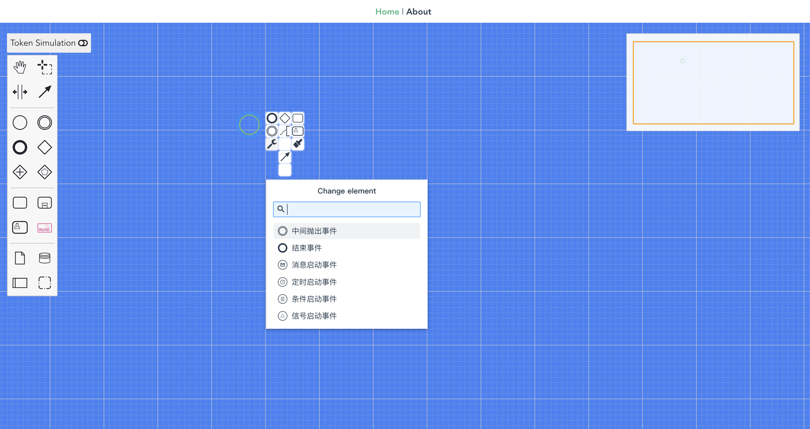

# 🚀 webpack打包一个vue组件

### 基于webpack5 vue2.7
    typescript v4.9.5
    webpack v5.0
    vue v2.7
    bpmn v14

### 支持ts tsx语法
    支持 jsx语法 render函数 

### 启动
    pnpm i 

    yarn run build:dev

## 使用
    引入组件
    import CloudpivotBpmn from'../../../dist/index';
    引入样式
    @import '../../../dist/css/main.css';

### dome 查看
    cd ./example

    pnpm i

    打包后运行(webpack)
    yarn run serve

    开发模式运行(vite)
    yarn run dev

### 最终效果

